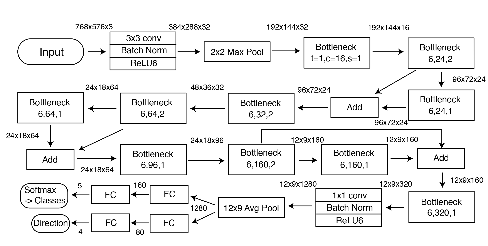

# Pedestrian-Traffic-Lights Dataset (PTL)

Pedestrian-Traffic-Lights (PTL) is a high-quality image dataset of street intersections, created for the detection of pedestrian traffic lights and zebra crossings. Images have variation in weather, position and orientation in relation to the traffic light and zebra crossing, and size and type of intersection. 

### Stats

|   | Training | Validation | Testing | Total
|---|----------|------------|---------|-------
Number of Images | 3456 | 864 | 739 | 5059
Percentage | 68.3% | 17.1% | 14.6% | 100%

## Labels
Each row of the csv files in the annotations folder contain a label for an image in the form:

\[file_name, class, x1, y1, x2, y2, blocked tag\].

An example is:

\['IMG_2178.JPG', '2', '1040', '1712', '3210', '3016', 'not_blocked'\].

Note that all labels are in String format, so it is neccessary to cast the coordinates to integers in python. 

Classes are as follows:

0: Red

1: Green

2: Countdown Green

3: Countdown Blank

4: None

With the following distribution:

|   | Red | Green | Countdown Green | Countdown Blank | None |
|---|-----|-------|-----------------|-----------------|------|
Number of Images | 1477 | 1303 | 963 | 904 | 412
Percentage | 29.2% | 25.8% | 19.0% | 17.9% | 8.1%

Images may contain multiple pedestrian traffic lights, in which the intended "main" traffic light was chosen. 

The coordinates represent the start and endpoint of the midline of the zebra crossing. They are labelled as the position on the original 4032x3024 sized image, so if a different resolution is used it is important to convert the image coordinates to the appropriate values or normalize the coordinates to be between a range of \[0, 1\].

## Download
Annotations can be downloaded from the annotations folder in this repo. 
There are three downloadable versions of the dataset. With our network, the [876x657](https://drive.google.com/open?id=1KhKT3mfcYcdb9Zwq5jZS1bkAJyogHZbZ) resolution images was used during training to accomodate random cropping. The [768x576](https://drive.google.com/open?id=117HUGczZwXFRbuBl7y4cHakH3xQV2Omo) version was used during validation and testing without a random crop. 

The 4032x3024 images will be available soon!

## Model
We created our own pytorch model that can be accessed from the Model folder in this repo. The folder contains both the code and the weights after running the code with the dataset. 

This is the structure of our network:

