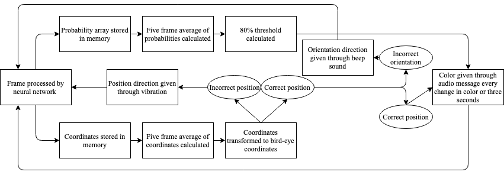

# Pedestrian Traffic Lights Dataset (PTL) and Traffic Light Detector LYTNet

### Introduction
This project consists of three sections. First, we provide an image dataset of street intersections, labelled with the color of the corresponding pedestrian traffic light and the position of the zebra crossing in the image. Second, we provide a neural network adapted off of MobileNet v2 (LYTNet) that accepts a larger input size while still running at near real-time speeds on an IPhone 7. Third, we provide a demo iOS application that is able to run LYTNet and output the appropriate information onto the phone screen. 

Our full paper is available at: https://arxiv.org/abs/1907.09706


Pedestrian-Traffic-Lights (PTL) is a high-quality image dataset of street intersections, created for the detection of pedestrian traffic lights and zebra crossings. Images have variation in weather, position and orientation in relation to the traffic light and zebra crossing, and size and type of intersection. 

### Stats

|   | Training | Validation | Testing | Total
|---|----------|------------|---------|-------
Number of Images | 3456 | 864 | 739 | 5059
Percentage | 68.3% | 17.1% | 14.6% | 100%

Use these stats for image normalization:  
mean = [120.56737612047593, 119.16664454573734, 113.84554638827127]  
std=[66.32028460114392, 65.09469952002551, 65.67726614496246]

## Labels
Each row of the csv files in the annotations folder contain a label for an image in the form:

\[file_name, class, x1, y1, x2, y2, blocked tag\].

An example is:

\['IMG_2178.JPG', '2', '1040', '1712', '3210', '3016', 'not_blocked'\].

Note that all labels are in String format, so it is neccessary to cast the coordinates to integers in python. 

Classes are as follows:

0: Red

1: Green

2: Countdown Green

3: Countdown Blank

4: None

With the following distribution:

|   | Red | Green | Countdown Green | Countdown Blank | None |
|---|-----|-------|-----------------|-----------------|------|
Number of Images | 1477 | 1303 | 963 | 904 | 412
Percentage | 29.2% | 25.8% | 19.0% | 17.9% | 8.1%

Images may contain multiple pedestrian traffic lights, in which the intended "main" traffic light was chosen. 

The coordinates represent the start and endpoint of the midline of the zebra crossing. They are labelled as the position on the original 4032x3024 sized image, so if a different resolution is used it is important to convert the image coordinates to the appropriate values or normalize the coordinates to be between a range of \[0, 1\].

## Download
Annotations can be downloaded from the annotations folder in this repo. 
There are three downloadable versions of the dataset. With our network, the [876x657](https://dl.orangedox.com/p6T3Fs) resolution images was used during training to accomodate random cropping. The [768x576](https://dl.orangedox.com/9ZvH36) version was used during validation and testing without a random crop. 

## Model

### LYTNet V1

We created our own pytorch neural network LYTNet that can be accessed from the Model folder in this repo. The folder contains both the code and the weights after running the code with the dataset. Given and input image, our model will return the appropriate color of the traffic light, and two image coordinates representing the predicted endpoints of the zebra crossing. 

Here are the precisions and recalls for each class:

|   | Red | Green | Countdown Green | Countdown Blank |
|---|-----|-------|-----------------|-----------------|
Precision | 0.97 | 0.94 | 0.99 | 0.86 |
Recall | 0.96 | 0.94 | 0.96 | 0.92 |

Here are the endpoint errors:

|   | Number of Images | Angle Error (degrees) | Startpoint Error | Endpoint Error |
|---|-----|-------|-----------------|-----------------|
Unblocked | 594 | 5.86 | 0.0725 | 0.0476 |
Blocked | 145 | 7.97 | 0.0918 | 0.0649 |
All | 739 | 6.27 | 0.0763 | 0.0510 |

Our network is adapted from MobileNet, with a larger input size of 768x576 designed for image classification tasks that involve a smaller object within the image (such as a traffic light). Certain layers from MobileNet v2 were removed for the network to run at a near real-time frame rate (21 fps), but still maintain high accuracy. 

This is the structure of LYTNet V1:


### LYTNet V2

Our network has been updated, achieving better accuracy. Below is a comparison between our two networks:

|   | Network | Red | Green | Countdown Green | Countdown Blank |
|---|---------|-----|-------|-----------------|-----------------|
| Precision | LYTNet V1 | 0.97 | 0.94 | 0.99 | 0.86 |
| | LYTNet V2 | **0.98** | **0.95** | 0.99 | **0.93** |
| Recall | LYTNet V1 | 0.96 | 0.94 | 0.96 | 0.92 |
| | LYTNet V2 | 0.96 | **0.96** | **0.97** | **0.97** |

| Network | Angle Error (degrees) | Startpoint Error | Endpoint Error |
|---|-------|-----------------|-----------------|
| LYTNet V1 | 6.27 | 0.0763 | 0.0510 |
| LYTNet V2 | **6.15** | **0.0759** | **0.0477** |

## Application
A demo iOS application is also provided. Requirements are iOS 11 and above. The application continuously iterates through the flowchart below:


To use the application, open the LYTNet demo xcode project, and drag the model_wm_1000.mlmodel file into the project to add a reference to it. Then, build the application while connecting a phone iOS 11 or above. 

## Citations
Please cite our paper in your publications if this github helped in your research. The BibTeX reference is as follows: 
```
@inproceedings{yu2019LYTNet,
  title   =  {{LYTNet}: A Convolutional Neural Network for Real-Time Pedestrian Traffic Lights and Zebra Crossing Recognition for the Visually Impaired},
  author  =  {Yu, Samuel and Lee, Heon and Kim, John},
  booktitle =  {International Conference on Computer Analysis of Images and Patterns (CAIP)},
  year    =  {2019}
}
```

